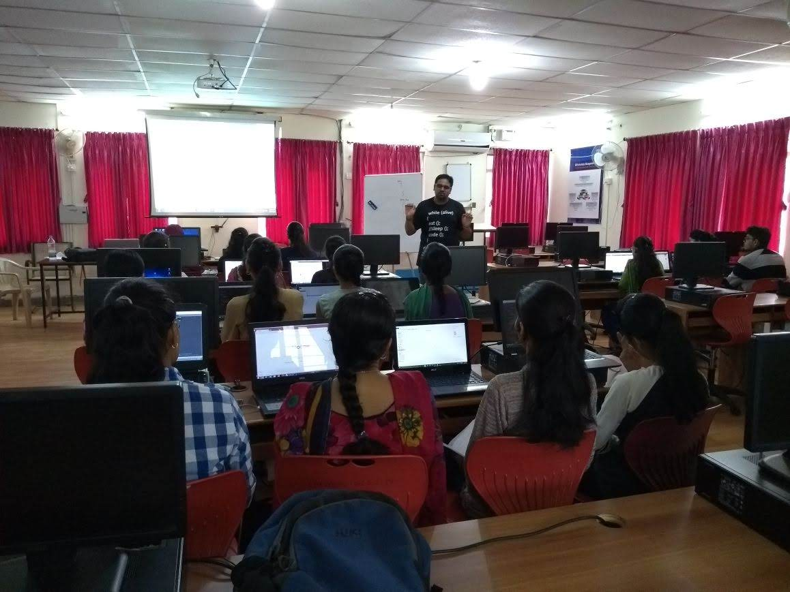
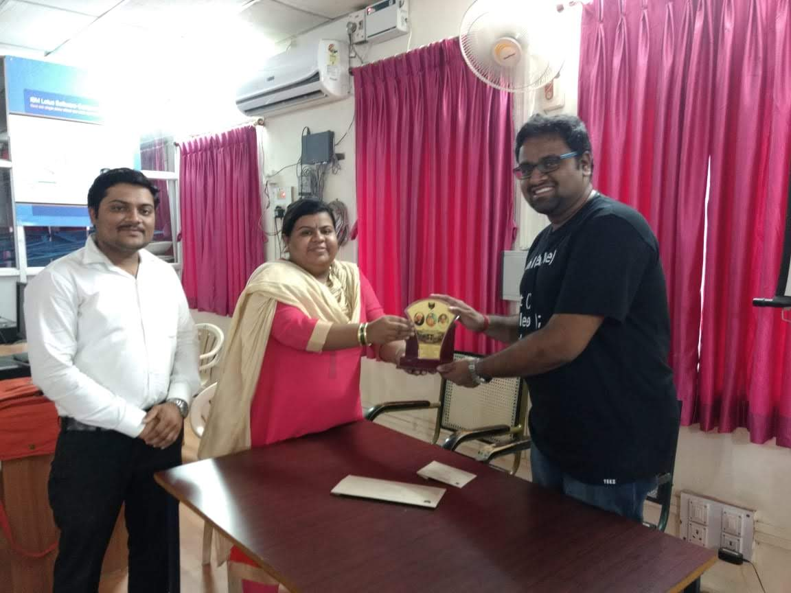
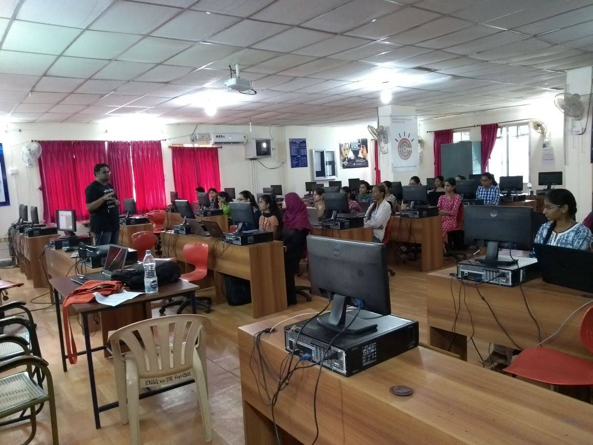

<link rel="stylesheet" type="text/css" href="../bootstrap.min.css">

  
Delivered a 4-day talk at BLDEACET, Vijayapura (Bijapur), Karnataka from 26th July to 29th July 2018 on "<i>Web Application Development using Python</i>".

  
The talk covered various topics on Flask Framework and also on current resesarch trends and how Python can be put to use to great extent.

  
The students gave good feedbacks and suggestions. More pleasing things were the attentiveness and willingness of the students to learn and unmatchable hospitality by the organizers! Will visit the place again if destiny permits :)

  
Oh yeah! They were kind enough to take me to popular monuments like Golgumbaaz and Ibrahim Roza :D

  <h3>Images</h3>
  

    

      

        <a href="../images/bldeacet/talk1.jpg" target="_blank">
          
          

          

        </a>
      

    

    

      

        <a href="../images/bldeacet/talk2.jpg" target="_blank">
          
          

            

          

        </a>
      

    

    

      

        <a href="../images/bldeacet/talk3.jpg" target="_blank">
          
          

            

          

        </a>
      

    

  

