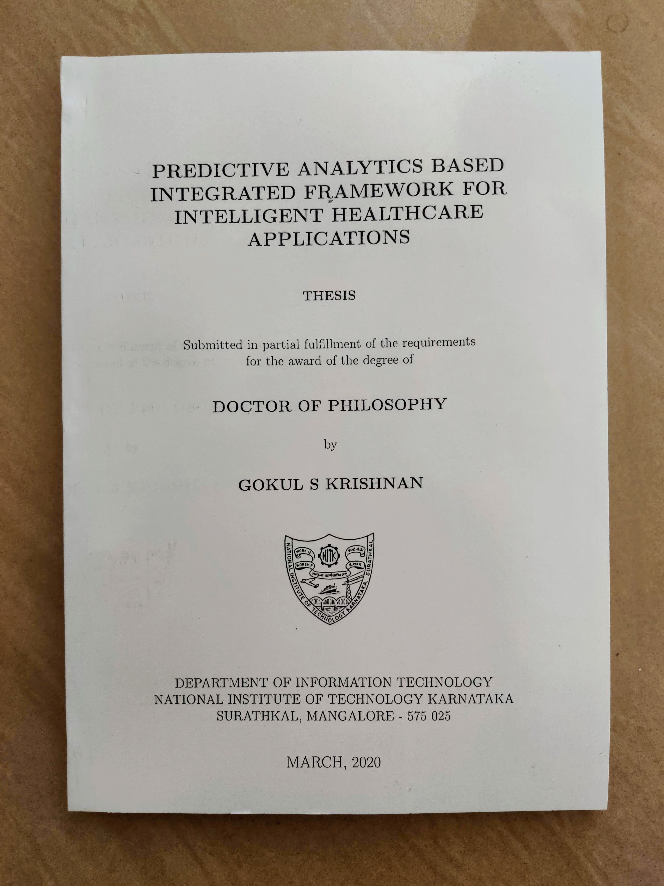
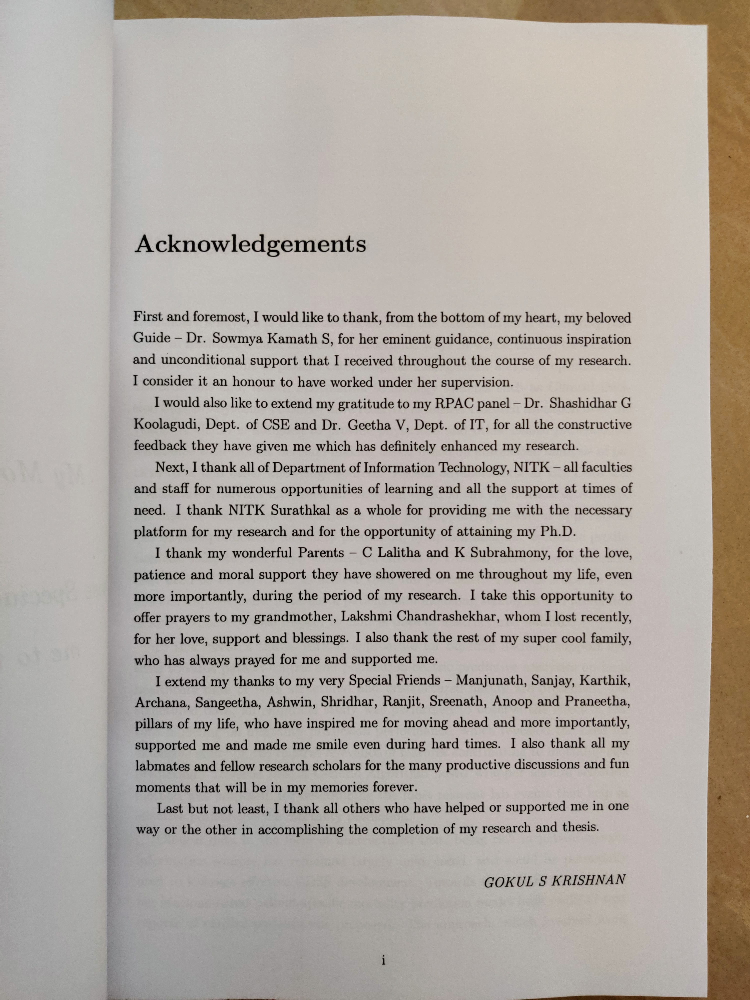

<link rel="stylesheet" type="text/css" href="../bootstrap.min.css">

  

  	5th March 2020 was a very special day to me! After an eventful 3 years and 8 months of beginning my Ph.D. research, I was finally able to submit my research thesis today, which is entitled - "<b><i>Predictive Analytics based Integrated Framework for Intelligent Healthcare Applications</i></b>". I have a bunch of people to be thankful to, the most important person being my beloved guide <b>Dr. Sowmya Kamath S</b>, who has been such a huge inspiration to me. I offer pranams to my late grandmother and also thank my parents and my special friends who have helped me in one way or other in completing my research and thesis! My entire copy of acknowledgements is attached below. I indeed feel calm and peaceful after all the effort I put into my research and especially, the thesis writing phase. Hoping for a timely review of my thesis now...
  

<h3>Images</h3>
  
 <!-- Row -->
    

      

        <a href="../images/thesis/1.jpg" target="_blank">
          
          

            

          

        </a>
      

    
 <!-- End Row -->
    

      

        <a href="../images/thesis/2.jpg" target="_blank">
          
          

            

          

        </a>
      

    

  
